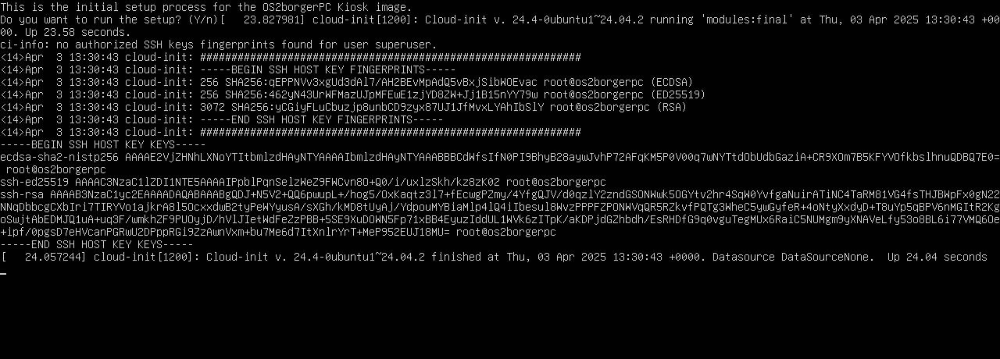
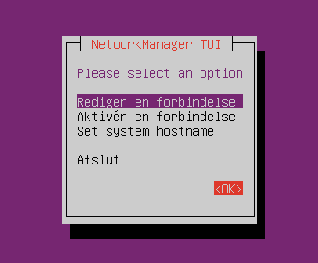
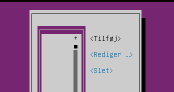
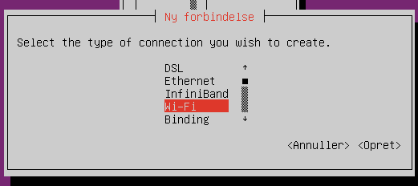
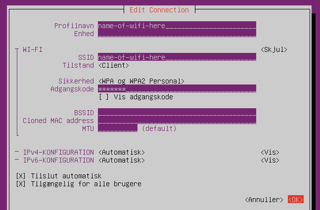

:::{note}
This is the installation guide for our 24.04 and newer images.  
The installation guide for our older images can be found [here](install_setup_legacy.rst).
:::

# Install OS2borgerPC Kiosk image

Get the most recent OS2borgerPC Kiosk image as provided by Magenta,
or build one yourself according to the instructions in the `image`
directory.

Copy the image to a USB or DVD and boot the target computer with it.
One cross platform program for this purpose is "Rufus".

The image will work with UEFI boot, but legacy boot is also supported.

The installation procedure will not ask a lot of questions. First of
all, it will ask you to specify the disk you will install on, as shown below:


If you're installing on a normal setup with only one hard disk attached,
the defaults will be fine - in that case, hit TAB until you reach "Done"
and hit ENTER. Otherwise, specify disk and partitions according to your
needs.

:::{hint}
You can optionally activate disk encryption by checking the option
"Encrypt the LVM group with LUKS" (hit TAB or use the arrow keys to
highlight the relevant line then press ENTER) and then entering a
passphrase. If you activate disk encryption, it will be necessary to
enter the chosen passphrase during every startup of the computer.
Entering the passphrase will require a physical keyboard.
:::

As the installation will destroy all data on the disk in question, you will
now be asked to "Confirm destructive action". To proceed, select "Continue".

:::{caution}
  This step *will* destroy all data on the disk you install on.
:::

The system will now install - this will take some time.

Remove the install media and reboot.

NOTE: If you chose to activate disk encryption, the computer
will ask for the passphrase shortly after the reboot.

The computer will now ask if you wish to start the built-in installation wizard.

The screen may contain output related to the upstart process, but this can be ignored.



Simply press ENTER if you wish to start the installation wizard. If you do not
wish to use the wizard, type n before pressing ENTER. If you exit the wizard,
you will already be logged in as superuser, but it will be necessary to run the
commands corresponding to each step of the wizard in order to complete the
installation. You can restart the wizard by running the command:
```sh
exit
```

# Getting internet access

First, the wizard will ask if you wish to install Wi-Fi drivers. This is
necessary if you wish to set up a wireless network or configure a static IP.
They are not installed by default. You don't need a network connection to install
the Wi-Fi drivers.

If the computer is connected with an Ethernet cable and a DHCP-enabled network, and
you do not wish to configure a static IP, the Wi-Fi drivers are not necessary.
However, if the computer will need to be connected to a wireless network in the
future, we recommend installing the Wi-Fi drivers anyway.

:::{note}
If you can't get internet access while using an Ethernet cable and a DHCP-enabled
network, it might help to switch to the HWE kernel. See the related guide below.
:::


Simply press ENTER to begin installing the Wi-Fi drivers. Type n before pressing
ENTER if you do not wish to install the Wi-Fi drivers.

You can install the Wi-Fi drivers without the wizard by running the command:
```sh
sudo wifi_setup
```

.. note:: If what you want to connect to is a hidden SSID, see the guide below.

If you choose to install Wi-Fi drivers, the wizard will ask if you want to manually
configure Wi-Fi after the drivers have been installed. If you choose not to install
Wi-Fi drivers, this step will be skipped.

Simply press ENTER to open `nmtui`, which is used to connect to a wireless network
or configure a static IP. Type n before pressing ENTER to skip manual Wi-Fi
configuration.

You can open `nmtui` without the wizard by running the command::
```sh
nmtui
```

You navigate within `nmtui` via the arrow keys, ENTER and ESC.

To connect to a new network choose "Activate a connection" in the menu.
If everything works as it should and the computer has a wireless card,
you will see a list of wireless networks (if any exist, of course).

:::{note}
If the computer can't see any wireless networks even though one or
more should exist, it might help to switch to the HWE kernel. See
the related guide below.
:::

Once you've found and selected the desired Wi-Fi from the list, you
will be prompted for its password.

If you need to connect to a WPA2 Enterprise network, it may not work
from `nmtui`. In this case we suggest, if possible, that the machine
is installed over another Wi-Fi or a LAN, and subsequently moved
to the WPA2 Enterprise Wi-Fi. We have a script in the admin system for
this purpose.

If you're already connected, e.g. through Ethernet, choose "Edit a
Connection". You can now setup static IP, etc.

:::{note}
In some cases, the wireless cards will not work properly unless the
computer is connected through Ethernet during installation. We
recommend that you install with an Internet-enabled Ethernet connection,
though in some cases it will also work without it - it depends on
your specific wireless card.
:::

Once you're connected to the network and exit `nmtui`, or if you skip manual
Wi-Fi configuration, the wizard will start the final setup. If you exit `nmtui`
without being connected to the network, the wizard will ask if you wish to retry
manual Wi-Fi configuration.

# Final setup and connecting to OS2borgerPC-admin (our admin system)

You can start the final setup without the wizard by running the command:
```sh
sudo os2borgerpc_kiosk_setup
```

The final setup will first install all dependencies for the OS2borgerPC client.

:::{note}
This may take some time.
:::

Finally, you'll be prompted for information to register the machine
with our admin system:

- `name`: Give the computer any valid name you like.
- `site`: If hosted by us: Use the site name we should've e-mailed you. If self-hosting or developing: Create a site, and
  specify its name here.

The final setup is now complete.

:::{danger}
Please change the `superuser` password *immediately* after deploying each
Kiosk!! There's a script in OS2borgerPC Admin to do this.
:::

# Setting up a browser

Once the computer is connected to the admin system and activated, you
may set it up to run a browser in kiosk mode.

There are two scripts needed to do this.

The first is called "OS2borgerPC Kiosk  - Chromium Installér" and will
install the browser and setup minimum GUI capabilities.

When this script has run successfully, you can configure Chromium to
start automatically on boot and configure the start page as needed.
You do this by running the script called "OS2borgerPC Kiosk - Chromium
Autostart".

For more information about these scripts, read their descriptions on the
admin system.

# Advanced topics (not relevant for most people)

## Connect to a hidden SSID

When it's a hidden SSID `nmtui` currently cannot see it, and thus can't activate  a connection to it.

Here follows a workaround:

You will need to exit the installation wizard to perform all of the required steps.

Type `nmtui` in the terminal and press Enter to start it.

You navigate within `nmtui` via the arrow keys, Enter and Escape.



Select "Rediger en forbindelse" ("Edit a connection") and press Enter.



On this page you may see a list of Wi-Fi SSIDs on the left, that the computer is able to see. Ignore them.

Select "Tilføj" ("Add") and press Enter.



Select "Wi-Fi", then "Opret" ("Create") and press Enter.



Here you fill out the information about the Wi-Fi.

You need to fill out "Profilnavn" ("Profile name"). This is the *connection name*.

:::{note}
Remember this profile/connection name for later in the guide.
:::

While technically the exact value of this is unimportant, we suggest making it the
name of the hidden SSID.

You also need to fill out "SSID".

You also need to select which type of "Sikkerhed" ("Security") it's using, such as WPA2 Personal, and the password.

You **don't** need to fill out "Enhed" ("Device") unless you have multiple Wireless Ethernet Cards and you want to specify
which of them should connect.

Once all the relevant details have been entered, select "OK" and press Enter.

Select "Tilbage" ("Back") and press Enter.

Select "Afslut" ("Quit") and press Enter.

In this step, you'll need the *connection name* you decided on earlier.

Now type in the following command and afterwards press Enter:
```sh
sudo nmcli con up "NAME-OF-CONNECTION-HERE"
```

:::{note}
If the name of the connection you chose has spaces in the name,
you'll need to write "" around the name in the command above. Otherwise they aren't strictly necessary.
:::

You may additionally want to run the following command, especially if you experience that the computer doesn't connect
to the Wi-Fi after a restart:
```sh
sudo nmcli con mod ”NAME-OF-CONNECTION-HERE” connection.autoconnect yes
```

Now you should have internet access through the wireless with hidden SSID!

## Switching to the HWE kernel (Hardware Enablement Kernel)

In some rare cases, the computer might not be able to connect to the internet via ethernet
or see any existing wireless networks because the standard kernel does not have the correct
drivers for the network card(s). This can potentially be fixed by switching to the HWE kernel.

In order to install the HWE kernel, it is necessary to exit the installation wizard. This can
be done before starting the wizard, as previously described, or by pressing Ctrl + C when the wizard
is asking a question. Once you have exited the wizard, run the following command. You don't need
a network connection to run this command and install the HWE kernel:
```sh
sudo hwe_install
```

Installing the HWE kernel might take some time. After the HWE kernel has been installed, you will
need to reboot the computer to allow it to switch to the HWE kernel. This can be done manually or
by running the following command:
```sh
sudo reboot
```

The computer will now be using the HWE kernel.

## Additional remote access

If you want additional remote access to this system, besides being able to run scripts
on it from the admin system, you can run the script called
"OS2borgerPC Kiosk  - Installer SSH og VNC". After this, you'll
be able to SSH to the machine and to see its display by connecting with
a VNC client.

:::{danger}
You *must* change the standard `superuser` password before or *immediately*
after running this script.
:::

:::{note}
You use `superuser`'s standard UNIX password to SSH. In order to
connect with VNC, you need to supply a specific VNC password as a
parameter for this script.
:::
