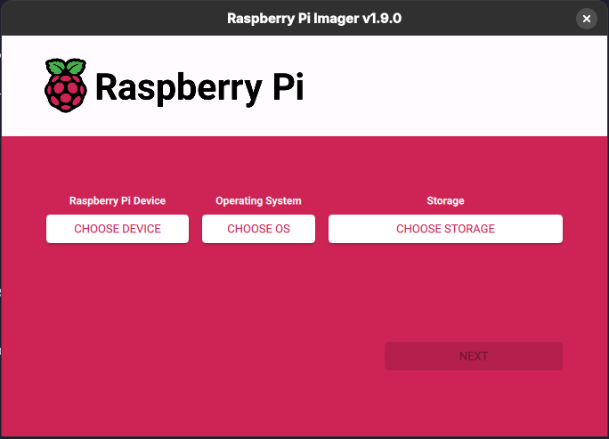
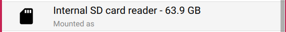
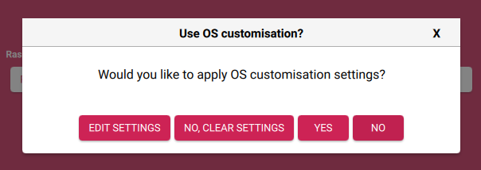
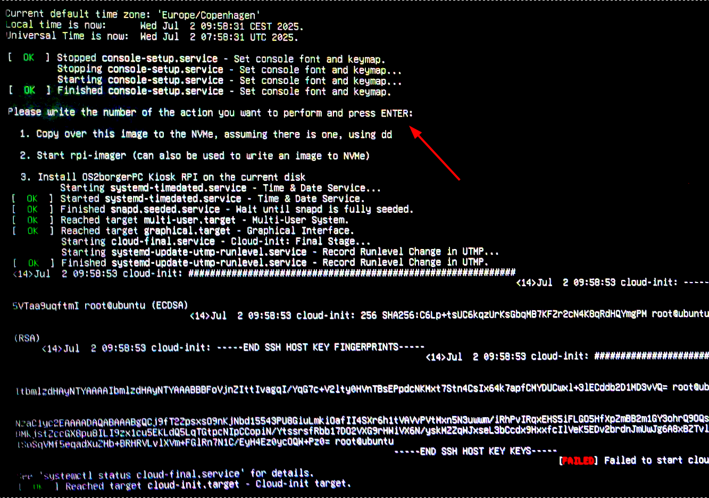

# Installing OS2borgerPC Kiosk RPi (ARM)

:::{Note}
- This image and guide has only been tested on Raspberry Pi 5.
- We do **not** recommend using the Raspberry Pi 5 edition that has less than 4 GiB of RAM. Additionally, we recommend using an edition with 8 GiB of RAM if the device is meant to display slideshows with videos.
- For better performance, particularly when it comes to video, we recommend using a Raspberry Pi 5 with an NVMe, and installing OS2borgerPC Kiosk RPi to the NVMe.
- The on/off schedules do not currently work on Raspberry Pi 5 due to hardware limitations. We are investigating possible solutions, but the on/off schedules will likely still work less well on Raspberry Pi due to the aforementioned hardware limitations.
:::

## Prerequisites

- If your RPi has an NVMe, and the NVMe has Raspberry Pi OS - or any other OS - preinstalled, you need an SD card + a USB stick for the installation. Otherwise, you can use either an SD card + USB or two USB devices for the installation.[^1] 
- If the former is the case, you also need a device with an SD card reader.
- If your RPi does not have an NVMe, it will be necessary to leave either an SD card or a USB connected so that the RPi can boot from it.

We have separate guides for installation with and without NVMe below.

## Installation to an NVMe (assuming your RPi has one installed)

:::{note}
We write "SD card" below, but if your NVMe does not come with Raspberry Pi OS preinstalled, it can also be a USB stick.[^1]
:::

### Overview

- Download our OS2borgerPC Kiosk RPi image and install rpi-imager on your computer.
- Use rpi-imager to write the OS2borgerPC Kiosk RPi image to the SD card.
- You *additionally*(!) need to copy over the same image to the root directory of a separate USB.
- Then you insert both the SD card and the USB, boot up the Raspberry Pi from the SD Card, which will start OS2borgerPC Kiosk RPi, and from there you select the first option and follow the guide, which flashes the copied over OS2borgerPC Kiosk RPi image to the NVMe.
- Then you power off the RPi, remove the SD card and the USB, boot the RPi, and it should start up OS2borgerPC Kiosk RPi again, but this time from the NVMe.

### Preparing the SD card and the USB

Download our OS2borgerPC Kiosk RPi image.

Then you need `rpi-imager` to write the image to the SD card.

You can install `rpi-imager` on your own computer. This is what we'd suggest.
Alternatively, if your Raspberry Pi comes with Raspberry Pi OS preinstalled, you can also create the SD Card from the Raspberry Pi itself.

:::{note}
If you don't have an internet connection on the device that you're launching `rpi-imager` from, you'll see a lot fewer options, but the ones that you need will always be present.
:::

Launch `rpi-imager`.

:::{danger}
Under "CHOOSE STORAGE" in the following steps, you can select **any disks**, including internal harddrives of your computer, so carefully select the correct option!
:::

1. "Raspberry Pi Device" / "CHOOSE DEVICE" can be skipped. Just leave it like it is.
2. Click "CHOOSE OS" and select "Use custom". Locate the image you downloaded from us previously.
3. Click "CHOOSE STORAGE" and select the SD card.

The SD card may look something like this, but it could vary depending on your OS:

4. Click "NEXT".

This screen should now appear:

...and here you choose "NO".

You'll then see a screen asking you to confirm the overwrite.

5. Double check that you've selected the SD card, and click "YES".

`rpi-imager` should now commence writing the image to the SD card!

After maybe 5 minutes, depending on the speed of your card reader and the SD card, you should see a message notifying you that the write was successful.

6. Click "OK".

You can now close `rpi-imager`.

Next, you also need to copy (not write) the same image to a separate USB. This image is what will be written to the NVMe.
Insert a USB stick in your computer and copy over our image to the root of the USB's file system, i.e. not inside a directory!

:::{warning}
If you don't put the image into the root of the USB's file system, or it doesn't have the default name, installing via dd will fail.
You can, however, still install via RPi-imager so long as the image is present on the USB.
:::

### Installation using dd

1. Insert the SD card and the USB into the Raspberry Pi.
2. Boot the Raspberry Pi.
3. When presented with a list of three options, write "1" (without quotes) and press "Enter".

:::{note}
The screen may contain output related to the upstart process, but this can be ignored. (See screenshot in the "Footnotes and appendix" section below.)
:::

4. Follow the guide to start writing the image from the USB to the NVMe via dd. The write process may take some time.
5. Once dd finishes, you will be prompted to press "Enter" to power off the Raspberry Pi. Press "Enter".
6. Once the Raspberry Pi has been powered off, remove the SD card and USB, then boot the Raspberry Pi again.
7. The Raspberry Pi should now boot from the NVMe rather than the SD card.

Go to the section "OS2borgerPC Kiosk RPi setup" below.

### Installation using RPi-imager

1. Insert the SD card and the USB into the Raspberry Pi.
2. Boot the Raspberry Pi.
3. When presented with a list of three options, write "2" (without quotes) and press "Enter".

:::{note}
The screen may contain output related to the upstart process, but this can be ignored. (See screenshot in the "Footnotes and appendix" section below.)
:::

4. Use RPi-imager to write the image from the USB to the NVMe, similarly to how RPi-imager was used to write our image to the SD card.
5. Power off the Raspberry Pi. This must be done via the power switch (see note below).
6. Once the Raspberry Pi has been powered off, remove the SD card and USB, then boot the Raspberry Pi again.
7. The Raspberry Pi should now boot from the NVMe rather than the SD card.

:::{Note}
RPi-imager is launched in full screen, and it has no way to close it, so when you need to exit it, you have to power off the RPi using its power switch.
:::

Go to the section "OS2borgerPC Kiosk RPi setup" below.

## Installation to SD Card or USB (If your RPi has no NVMe)

:::{Note}
Refer to the earlier section "Preparing the SD card and the USB" for a more detailed description of the first three steps.
:::

1. Download our OS2borgerPC Kiosk RPi image.
2. Install rpi-imager on your computer.
3. Use rpi-imager to write our OS2borgerPC Kiosk RPi Image to the SD card or the USB stick.
4. Insert the SD card or USB stick into the Raspberry Pi.
5. Boot the Raspberry Pi.

Go to the section "OS2borgerPC Kiosk RPi setup" below.

## OS2borgerPC Kiosk RPi setup

At this point, you should have booted the Raspberry Pi off of the disk that it's supposed to run off.

Once the system has booted, you should see a text menu listing three options.

:::{note}
The screen may contain output related to the upstart process, but this can be ignored. (See screenshot in the "Footnotes and appendix" section below.)
:::

Write "3" (without quotes) and press "Enter".

An installation wizard begins, giving you the option to manually set up the internet connection, if necessary.

Finally, the wizard will start the registration with the OS2borgerPC Admin Portal, where you'll be prompted for:
1. The hostname that you want your computer to have, which will also show up on the OS2borgerPC Admin Portal.
2. The UID of the site on the OS2borgerPC Admin Portal that you want to register the computer with.

## Configuration and advanced topics

For the next steps, showing how to configure the computer to run OpenStream or Chromium, see:
[Configuration and advanced topics](configuration.md)

## Footnotes and appendix

[^1]: The reason is, that the RPi boot order will boot SD -> NVMe -> USB, and if you have an NVMe, and the NVMe has an OS installed, the RPi will **always** boot that before USB.

When the menu is shown, you may see output related to the upstart process, but this can be ignored.
In this example, the actual menu is indicated by the red arrow.

