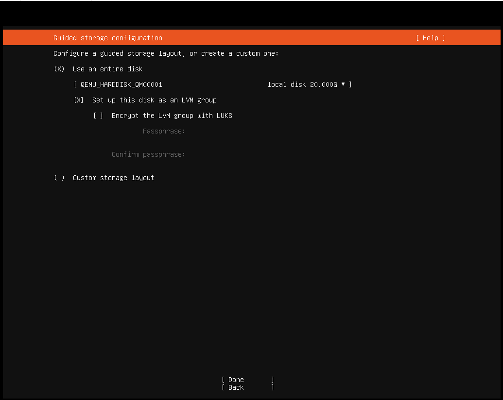
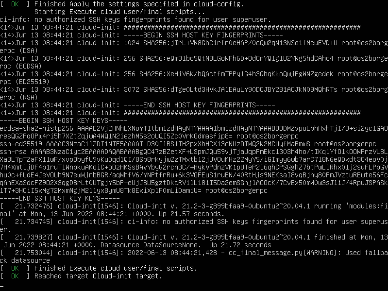

# Legacy installation guide - for 22.04 and older (x64)

:::{note}
This is the Installation guide for OS2borgerPC Kiosk 22.04 and older.
We instead recommend installing our newer 24.04 images.
The installation guide for the newer images can be found [here](install_setup_x64.md).
:::

## Install OS2borgerPC Kiosk image

Get the most recent OS2borgerPC Kiosk image as provided by Magenta,
or build one yourself according to the instructions in the `image`
directory.

Copy the image to a USB or DVD and boot the target computer with it.
One cross platform program for this purpose is "Rufus".

The image will work with UEFI boot, but legacy boot is also supported.

The installation procedure will not ask a lot of questions. First of
all, it will ask you to specify the disk you will install on, as shown below:



If you're installing on a normal setup with only one hard disk attached,
the defaults will be fine - in that case, hit TAB until you reach "Done"
and hit ENTER. Otherwise, specify disk and partitions according to your
needs.

OPTIONAL: You can activate disk encryption by checking the option
"Encrypt the LVM group with LUKS" (hit TAB or use the arrow keys to
highlight the relevant line then press ENTER) and then entering a
passphrase. If you activate disk encryption, it will be necessary to
enter the chosen passphrase during every startup of the computer.
Entering the passphrase will require a physical keyboard.

As the installation will destroy all data on the disk in question, you will
now be asked to "Confirm destructive action". To proceed, select "Continue".

:::{warning}
This step *will* destroy all data on the disk you install on.
:::

The system will now install - this will take some time.

Remove the installation media and reboot.

:::{note}
If you chose to activate disk encryption, the computer
will ask for the passphrase shortly after the reboot.
:::

The login screen may contain output related to the upstart process:



This is not a problem and you'll be able to login as the user `superuser` with password `superuser`.

:::{danger}
Please change this password *immediately* after deploying each
server!! There's a script in OS2borgerPC Admin to do this.
:::

## Getting internet access

If you installed with an Ethernet cable and a DHCP-enabled network, the
computer is already online. If you need to set up wireless network or
configure a static IP, you must first install basic wireless
capabilities - these are not installed by default. You don't need a
network connection, just enter the command:
```sh
sudo wifi_setup
```

:::{note}
If you don't need to use a wireless connection or do any
other special network setup like setting up a static IP address,
there is no need to execute this command.
:::

:::{note}
If what you want to connect to is a hidden SSID, see [Configuration and advanced topics](configuration.md).
:::

With this in place, enter the following command:
```sh
nmtui
```

You navigate within `nmtui` via the arrow keys, Enter and Escape.

To connect to a new network choose "Activate a connection" in the menu.
If everything works as it should and the computer has a wireless card,
you will see a list of wireless networks (if any exist, of course).

Once you've found and selected the desired Wi-Fi from the list, you
will be prompted for its password.

If you need to connect to a WPA2 Enterprise network, it may not work
from `nmtui`. In this case we suggest, if possible, that the machine
is installed over another Wi-Fi or a LAN, and subsequently moved
to the WPA2 Enterprise Wi-Fi. We have a script in the admin system for
this purpose.

If you're already connected, e.g. through Ethernet, choose "Edit a
Connection". You can now setup static IP, etc.

:::{note}
In some cases, the wireless cards will not work properly unless the
computer is connected through Ethernet during installation. We
recommend that you install with an Internet-enabled Ethernet connection,
though in some cases it will also work without it - it depends on
your specific wireless card.
:::

## Connect to OS2borgerPC-admin (our admin system)

Once you're connected to the network, enter the command:
```sh
sudo os2borgerpc_kiosk_setup
```

This will install all dependencies for the OS2borgerPC client.

:::{note}
This may take some time.
:::

Finally you'll be prompted for information to register the machine
with our admin system:

- `name`: Give the computer any valid name you like.
- `site`: If hosted by us: Use the site name we should've e-mailed you. If self-hosting or developing: Create a site, and
  specify its name here.
- `server`: If hosted by us: Just press enter. If self-hosting specify the domain of your server. For development its
  likely some port on localhost.

## Configuration and advanced topics

For the next steps, showing how to configure it to run OpenStream or Chromium, see:
[Configuration and advanced topics](configuration.md)
